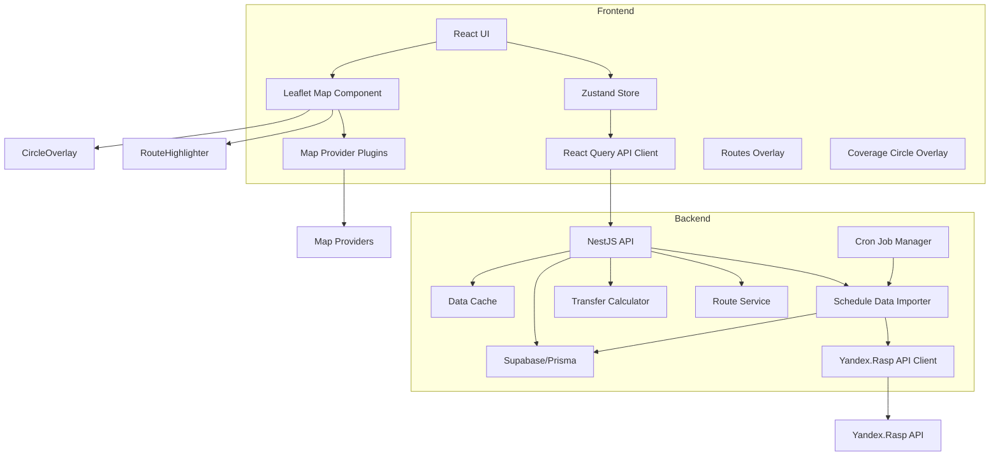
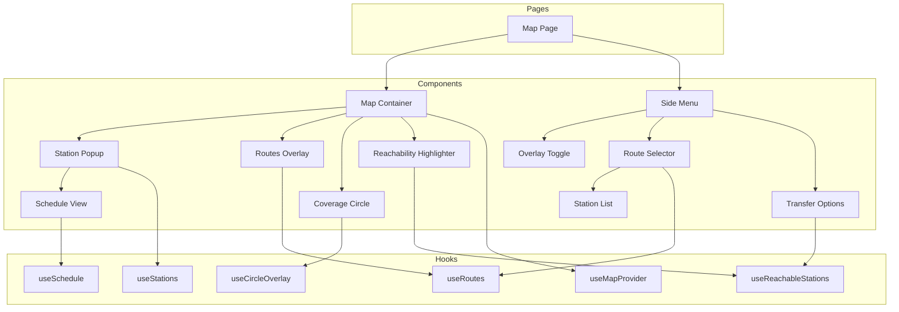
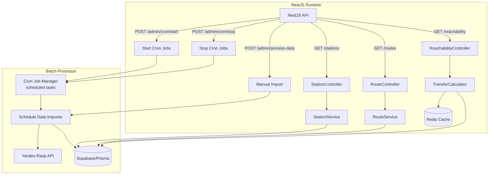
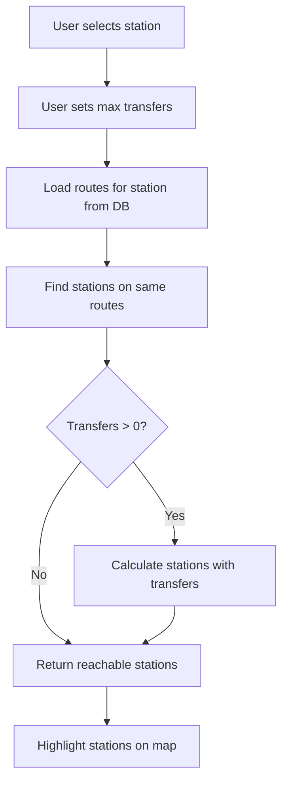
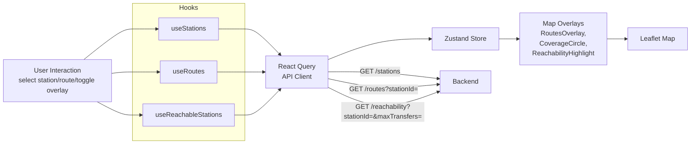
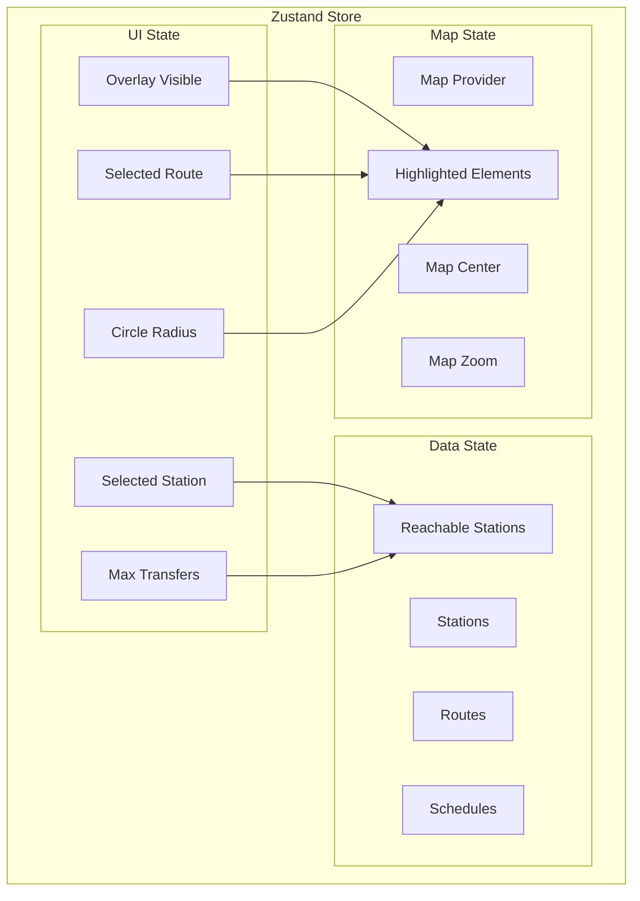

## System Architecture

## UI Component Structure

## Backend API Layer

## Reachability Calculation Flow (Backend)

## Frontend "Stations / Routes / Reachability" Data Flow

## Feature Implementation Details

### 1. Route Selection in Menu

When a user selects a route from the menu:

- The frontend searches cache for routes and loads it's stations
- The frontend highlights these stations on the map and can optionally display them in a list

### 2. Station Reachability Highlighting

This feature shows which stations can be reached from a selected station:

- Direct connections: Stations on the same route(s) as the selected station
- Transfer connections: Stations reachable with N transfers (configurable by user)
- The backend calculates this using a graph-based algorithm considering:
  - Routes that share stations (transfer points)

### 3. Coverage Circle vs. Reachable Stations

Two distinct features:

1. **Coverage Circle**: A simple geographic radius around a station (e.g., 1km, 3km)

   - Visualizes the physical area covered by the station
   - Configurable radius in the main menu
   - Implemented using Leaflet's circle overlay via the `CoverageCircle` component

2. **Reachable Stations**: Stations connected by train routes
   - Shows network connectivity rather than geographic proximity
   - Based on route connections and possible transfers
   - Visualized by highlighting stations on the map

## State Management Structure

