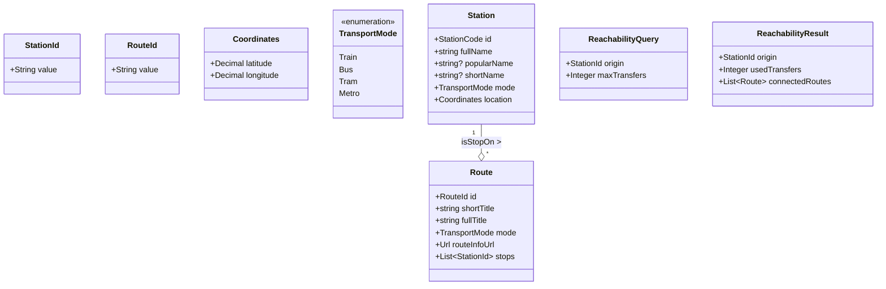
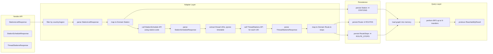
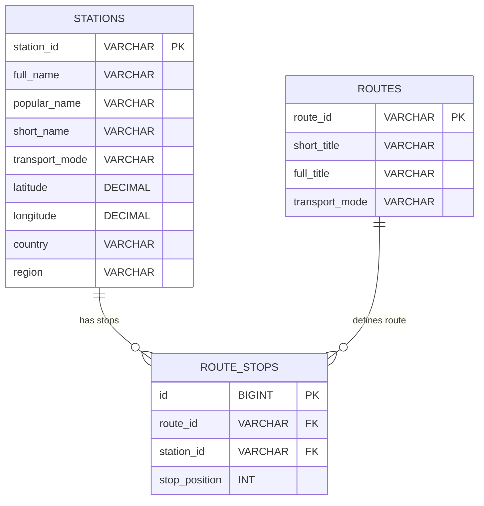

### Backend data structure

```mermaid
classDiagram
    %% === Value Objects ===
    class StationId {
      +String value
    }
    class RouteId {
      +String value
    }
    class Coordinates {
      +Decimal latitude
      +Decimal longitude
    }
    class TransportMode {
      <<enumeration>>
      Train
      Bus
      Tram
      Metro
    }
    
    %% === Domain Entities ===
    class Station {
      +StationCode id
      +string fullName
      +string? popularName
      +string? shortName
      +TransportMode mode
      +Coordinates location
    }
    class Route {
      +RouteId id
      +string shortTitle
      +string fullTitle
      +TransportMode mode
      +Url routeInfoUrl
      +List~StationId~ stops
    }
    class ReachabilityQuery {
      +StationId origin
      +Integer maxTransfers
    }
    class ReachabilityResult {
      +StationId origin
      +Integer usedTransfers
      +List~Route~ connectedRoutes
    }
    
    %% === Associations ===
    Station "1" --o "*" Route : isStopOn >
```

### Extract from Yandex API flow

```mermaid
flowchart LR
    subgraph Yandex API
      A[StationsListResponse]
      C[StationScheduleResponse]
      D[ThreadStationsResponse]
    end

    subgraph Adapter Layer
      A --> F[filter by country/region]
      F --> A1[parse StationListResponse]
      A1 --> A2[map to Domain Station]

      %% New: use station codes to fetch schedules
      A2 --> SchedCall[call StationSchedule API<br/>using station.code]
      SchedCall --> C1[parse StationScheduleResponse]
      C1 --> TUIDs[extract thread UIDs, ignore timetable]

      %% Fetch full thread info per UID
      TUIDs --> ThreadCall[call ThreadStations API<br/>for each UID]
      ThreadCall --> B1[parse ThreadStationsResponse]
      B1 --> B2[map to Domain Route & stops]
    end

    subgraph Persistence
      A2 --> P1[persist Station ➔ STATIONS]
      B2 --> P3[persist Route ➔ ROUTES]
      B2 --> P4[persist RouteStops ➔ ROUTE_STOPS]
    end

    subgraph Query Layer
      P1 & P4 --> Q1[load graph into memory]
      Q1 --> Q2[perform BFS up to N transfers]
      Q2 --> Q3[produce ReachabilityResult]
    end
```

## Db schema

```mermaid
erDiagram
    %% === Tables ===
    STATIONS {
      station_id         VARCHAR PK
      full_name             VARCHAR
      popular_name          VARCHAR
      short_name            VARCHAR
      transport_mode        VARCHAR
      latitude              DECIMAL
      longitude             DECIMAL
      country               VARCHAR
      region                VARCHAR
    }
    ROUTES {
      route_id           VARCHAR PK
      short_title           VARCHAR
      full_title            VARCHAR
      transport_mode        VARCHAR
    }
    ROUTE_STOPS {
      id                  BIGINT PK
      route_id           VARCHAR FK
      station_id         VARCHAR FK
      stop_position         INT
    }
    %% === Relationships ===
    STATIONS ||--o{ ROUTE_STOPS : "has stops"
    ROUTES   ||--o{ ROUTE_STOPS : "defines route"
```
