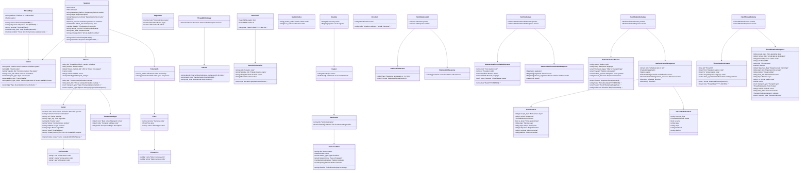

```mermaid
classDiagram

%% ====================
%% Core Domain Models
%% ====================

class Station {
  +string code "Station code in Yandex Schedule system"
  +string title "Station name"
  +string? popular_title "Common name of the station"
  +string? short_title "Short name of the station"
  +enum transport_type "Type of transport"
  +enum station_type "Type of station"
  +string station_type_name "Station type name in human-readable format"
  +enum type "Type of point (station or settlement)"
}

class CarrierCodes {
  +string? icao "ICAO carrier code"
  +string? sirena "Sirena carrier code"
  +string? iata "IATA carrier code"
}

class Carrier {
  +number code "Carrier code in Yandex Schedule system"
  +string? contacts "Contact information"
  +string? url "Carrier website"
  +string? logo_svg "SVG logo URL"
  +string title "Carrier name"
  +string? phone "Contact phone number"
  +CarrierCodes codes "Carrier codes (ICAO/IATA/Sirena)"
  +string? address "Legal address"
  +string? logo "Raster logo URL"
  +string? email "Email address"
  +string? thread_method_link "URL for thread info request"
}

class TransportSubtype {
  +string? color "Main color of transport in hex"
  +string? code "Transport subtype code"
  +string? title "Transport subtype description"
}

class Thread {
  +string uid "Thread identifier in Yandex Schedule"
  +string title "Thread name (full station names)"
  +string number "Route number"
  +string short_title "Thread name (short station names)"
  +string? thread_method_link "URL for thread info request"
  +Carrier carrier
  +enum transport_type "Type of transport (plane/train/etc.)"
  +string? vehicle "Vehicle name"
  +TransportSubtype? transport_subtype
  +enum? express_type "Express train type (express/aeroexpress)"
}

class Interval {
  +string density "Interval description (e.g., taxi every 15-30 mins)"
  +string begin_time "Service begin time (ISO 8601)"
  +string end_time "Service end time (ISO 8601)"
}

class ThreadWithInterval {
  +Interval? interval "Schedule interval info for regular services"
}

class TicketPrice {
  +number cents "Minor currency units"
  +number whole "Major currency units"
}

class Place {
  +string currency "Currency code"
  +TicketPrice price
  +string? name "Ticket type name"
}

class TicketsInfo {
  +bool et_marker "Electronic ticket availability"
  +Place[] places "Available ticket types and prices"
}

class Segment {
  +string arrival "Arrival time (ISO 8601)"
  +Station from
  +Thread thread
  +string departure_platform "Departure platform number"
  +string departure "Departure time (ISO 8601)"
  +string stops "Stops description"
  +string? departure_terminal "Departure terminal name"
  +Station to
  +bool has_transfers "Indicates presence of transfers"
  +TicketsInfo? tickets_info "Ticket pricing info"
  +number duration "Trip duration in seconds"
  +string? arrival_terminal "Arrival terminal name"
  +string start_date "Departure date"
  +string arrival_platform "Arrival platform number"
}

class Pagination {
  +number total "Total matching routes"
  +number limit "Results per page"
  +number offset "Results offset"
}

class SearchInfoLocation {
  +string code "Location code"
  +enum type "Location type (station/settlement)"
  +string? popular_title "Popular location name"
  +string short_title "Short location name"
  +string title "Full location name"
}

class SearchInfo {
  +string date "Search date (YYYY-MM-DD)"
  +SearchInfoLocation from
  +SearchInfoLocation to
}

class ThreadStop {
  +string? arrival "Arrival time (ISO 8601)"
  +string? departure "Departure time (ISO 8601)"
  +string? terminal "Terminal (if any)"
  +string platform "Platform or track number"
  +Station station
  +number? stop_time "Stop duration (seconds)"
  +number duration "Travel time from previous stop (seconds)"
}

class StationCodes {
  +string yandex_code "Yandex station code"
  +string? esr_code "ESR station code"
}

class StationListItem {
  +string title "Station name"
  +string direction "Train direction (may be empty)"
  +StationCodes codes
  +enum station_type "Type of station"
  +enum transport_type "Type of transport"
  +number|string longitude "Station longitude"
  +number|string latitude "Station latitude"
}

class Settlement {
  +string title "Settlement name"
  +StationListItem[] stations "List of stations with geo info"
}

class Region {
  +string title "Region name"
  +Settlement[] settlements "List of settlements"
}

class Country {
  +string title "Country name"
  +Region[] regions "List of regions"
}

class Direction {
  +string code "Direction code (e.g., 'arrival', 'Moscow')"
  +string title "Direction name"
}

%% ====================
%% API Endpoints
%% ====================

class FetchStationsList {
  +StationsListParams params
  +StationsListResponse returns
}

class FetchSchedule {
  +BetweenStationsScheduleParams params
  +BetweenStationsScheduleResponse returns
}

class FetchStationSchedule {
  +StationScheduleParams params
  +StationScheduleResponse returns
}

class FetchThreadStations {
  +ThreadStationsParams params
  +ThreadStationsResponse returns
}

%% Endpoint-specific types

class StationsListParams {
  +string? lang "Response language (e.g., 'ru_RU')"
  +enum? format "Response format (json/xml)"
}

class StationsListResponse {
  +Country[] countries "List of countries with stations"
}

class BetweenStationsScheduleParams {
  +string from "From station code"
  +string to "To station code"
  +string date "Date (YYYY-MM-DD)"
  +number? offset "Results offset"
  +number? limit "Results per page"
  +bool? show_intervals "Show interval routes"
}

class BetweenStationsScheduleResponse {
  +Pagination pagination
  +Segment[] segments "Found routes"
  +Segment[] interval_segments "Routes without fixed schedule"
  +SearchInfo search
}

class StationScheduleParams {
  +string station "Station code"
  +string? lang "Response language"
  +enum? format "Response format (json/xml)"
  +string? date "Schedule date (YYYY-MM-DD)"
  +enum? transport_types "Filter by transport type"
  +enum? event "Event filter (arrival/departure)"
  +enum? system "Station code system"
  +enum? show_systems "Response code systems"
  +string? direction "Direction filter (for suburban)"
  +string? result_timezone "Response timezone"
}

class StationScheduleResponse {
  +string? date "Schedule date or null"
  +Pagination pagination
  +Station station
  +ScheduleItem[] schedule "Scheduled services"
  +IntervalScheduleItem[] interval_schedule "Interval services"
  +Direction? schedule_direction
  +Direction[]? directions
}

class ThreadStationsParams {
  +string uid "Thread ID"
  +string? from "Departure station code"
  +string? to "Arrival station code"
  +enum? format "Response format (json/xml)"
  +enum? lang "Response language code"
  +string? date "Thread date (YYYY-MM-DD)"
  +enum? show_systems "Included station coding systems"
}

class ThreadStationsResponse {
  +string except_days "Non-operating days"
  +string? arrival_date "Arrival date at destination"
  +string? from "Departure station code"
  +string uid "Thread ID"
  +string title "Thread name"
  +Interval? interval
  +string? departure_date "Departure date from origin"
  +string start_time "Departure time at start"
  +string number "Route number"
  +string short_title "Short thread name"
  +string days "Service days"
  +string? to "Arrival station code"
  +Carrier carrier
  +enum transport_type "Transport type"
  +ThreadStop[] stops "List of stops"
  +string? vehicle "Vehicle name"
  +string start_date "First service date"
  +TransportSubtype transport_subtype
  +enum? express_type "Express train type"
}

class ScheduleItem {
  +string? except_days "Non-service days"
  +string? arrival "Arrival time"
  +ThreadWithInterval thread
  +bool is_fuzzy "Times approximate"
  +string days "Service days"
  +string stops "Stops description"
  +string? departure "Departure time"
  +string? terminal "Airport terminal"
  +string platform "Platform number"
}

class IntervalScheduleItem {
  +string? except_days
  +ThreadWithInterval thread
  +bool is_fuzzy
  +string days
  +string stops
  +string? terminal
  +string platform
}

%% ====================
%% Relationships
%% ====================

Carrier --> CarrierCodes
Thread --> Carrier
Thread --> TransportSubtype
ThreadWithInterval --> Interval
Segment --> Station
Segment --> Thread
Segment --> TicketsInfo
TicketsInfo --> Place
Place --> TicketPrice
ThreadStop --> Station
Settlement --> StationListItem
Region --> Settlement
Country --> Region
SearchInfo --> SearchInfoLocation

FetchStationsList --> StationsListParams
FetchStationsList --> StationsListResponse
FetchSchedule --> BetweenStationsScheduleParams
FetchSchedule --> BetweenStationsScheduleResponse
FetchStationSchedule --> StationScheduleParams
FetchStationSchedule --> StationScheduleResponse
FetchThreadStations --> ThreadStationsParams
FetchThreadStations --> ThreadStationsResponse

StationScheduleResponse --> ScheduleItem
StationScheduleResponse --> IntervalScheduleItem
```